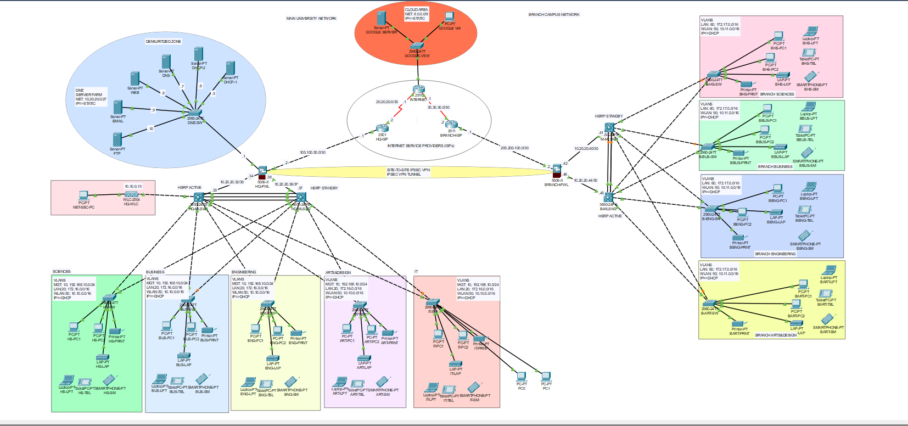
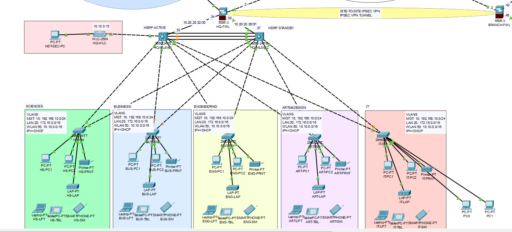
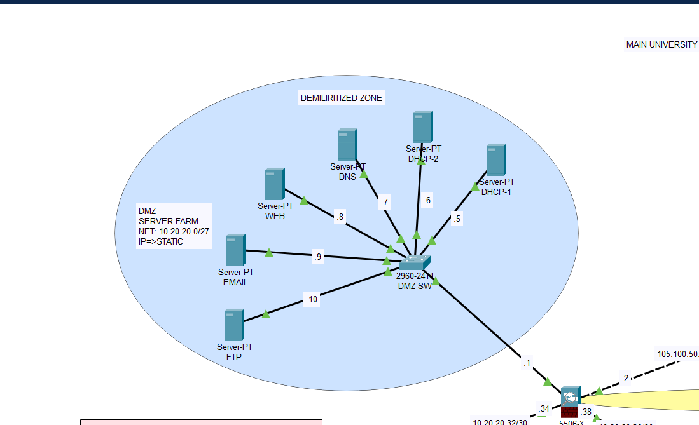
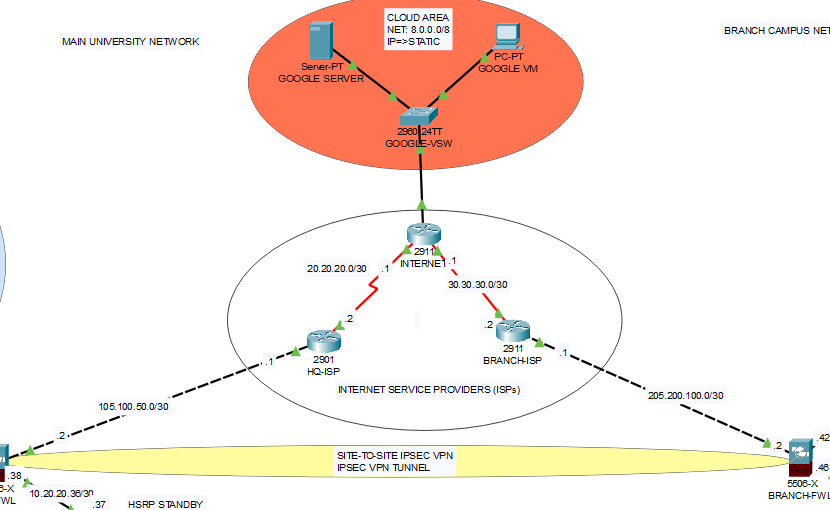
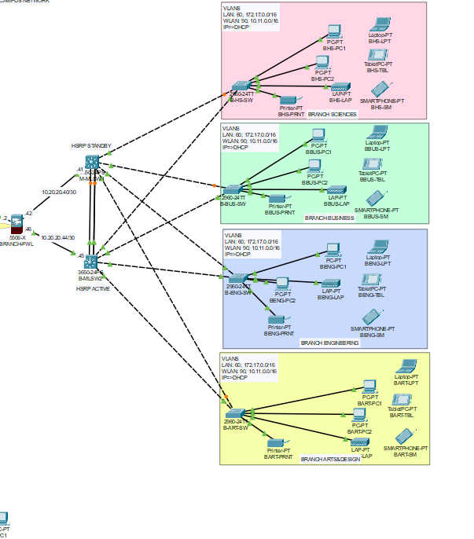

# 🌐 Enterprise Hybrid Campus & Branch Network Infrastructure

[](https://www.netacad.com/)
[](https://www.cisco.com/)
[](https://www.cisco.com/)

> A highly redundant, production-grade enterprise network architecture simulated using Cisco Packet Tracer. The project showcases a fully fault-tolerant **Main University Campus**, a dedicated **Branch Campus**, an isolated **Demilitarized Zone (DMZ) Server Farm**, public **Cloud & ISP Infrastructure**, and a secure **Site-to-Site IPsec VPN Tunnel** interconnecting geographically separated sites via Cisco ASA Firewalls.

---

## 📐 Enterprise Architecture Overview

The system models a complete enterprise corporate infrastructure with multi-site connectivity, DMZ server isolation, WAN routing, and core gateway redundancy.



---

## 🔍 Network Sub-System Breakdown

### 1. Main University Campus Infrastructure
The primary campus utilizes a high-availability Multi-Layer Switching core (`HQ-MLSW1` and `HQ-MLSW2`) configured with **HSRP (Hot Standby Router Protocol)** for dynamic default gateway failover. It provides access layer segmentation and dynamic IP routing across departmental subnets, complemented by a **Cisco 2504 Wireless LAN Controller (WLC)** for enterprise mobility.

* **Departmental Subnets:** Sciences, Business, Engineering, Arts & Design, IT.
* **VLAN Configuration:** Management VLAN 10 (`192.168.10.0/24`), LAN VLAN 20 (`172.16.0.0/16`), Wireless WLAN 50 (`10.10.0.0/16`).



---

### 2. High-Security DMZ (Demilitarized Zone) Server Farm
An isolated server environment managed by a Cisco 2960 DMZ Switch and secured behind a Cisco ASA 5506-X Firewall (`HQ-FWL`). All servers use static IP addressing (`10.20.20.0/27`) to strictly control inbound public internet exposure and internal traffic access rules.

* **Hosted Services:** Web Server (`.8`), DNS Server (`.7`), Redundant DHCP Servers (`.5`, `.6`), Email Server (`.9`), and FTP Storage (`.10`).



---

### 3. Core WAN, ISP Infrastructure & Site-to-Site IPsec VPN
Simulates multi-provider WAN connectivity through dedicated ISP Routers (`HQ-ISP`, `BRANCH-ISP`, `INTERNET`). A **Site-to-Site IPsec VPN Tunnel** is established directly between the Headquarters ASA Firewall (`HQ-FWL`) and Branch Firewall (`BRANCH-FWL`) to encrypt cross-site enterprise communication across public WAN paths. A public **Cloud Area** (`8.0.0.0/8`) models external web services (Google Server & VM).



---

### 4. Branch Campus Network
Models an autonomous secondary campus infrastructure equipped with its own redundant Core MLS Pair (`B-MLSW1` and `B-MLSW2`) running **HSRP Active/Standby**. It mirrors HQ operational capabilities across local departmental switches while routing inter-site traffic securely over the IPsec VPN tunnel.

* **Branch VLANs:** LAN VLAN 60 (`172.17.0.0/16`), WLAN 90 (`10.11.0.0/16`).



---

## 🔥 Key Technical Highlights & Security Mechanisms

* **First-Hop Redundancy (HSRP):** Active/Standby gateway failover deployed on both HQ and Branch Multi-Layer Switches ensuring uninterrupted uptime (RPO/RTO ~ 0).
* **Enterprise Security & Perimeter Protection:** ASA 5506-X Next-Generation Firewalls enforcing strict Access Control Lists (ACLs), NAT/PAT translation, and DMZ network isolation.
* **Encrypted Inter-Site Transport:** IPsec Site-to-Site VPN encapsulation protecting multi-branch data transit across untrusted ISP links.
* **Wireless Mobility Integration:** Cisco WLC 2504 orchestrating CAPWAP Lightweight APs across WLAN subnets.
* **Network Services Redundancy:** Split-scope DHCP implementation paired with centralized DNS and Mail infrastructure.

---

## 📂 Repository Layout

```text
enterprise-campus-network/
├── topology/
│   └── enterprise_campus_network.pkt   # Full Cisco Packet Tracer simulation file
├── images/
│   ├── campus-network-topology.png     # Full high-resolution network overview snapshot
│   ├── main-campus.png                 # Main Campus & Core MLS HSRP snapshot
│   ├── dmz-zone.png                    # DMZ Server Farm architecture snapshot
│   ├── wan-vpn.png                     # WAN, Cloud & IPsec VPN Tunnel snapshot
│   └── branch-campus.png               # Branch Campus layout snapshot
└── README.md                           # System documentation and setup guide
```

---

## 🚀 How to Run and Test

1. Download and install **Cisco Packet Tracer** (v8.0+ recommended).
2. Clone this repository:
   ```bash
   git clone https://github.com/MOHAMMED-MOSTAFA-ELSAEED/enterprise-campus-network-infrastructure.git
   ```
3. Open `topology/enterprise_campus_network.pkt` inside Packet Tracer.
4. Execute test scenarios:
   * **Ping Verification:** Test ICMP reachability from `HS-PC1` (HQ Sciences) to `BHS-PC1` (Branch Sciences) via the IPsec Tunnel.
   * **DMZ Access:** Access the Web/FTP services from internal PCs or public Cloud VM (`GOOGLE VM`).
   * **Gateway Failover:** Disable the active MLS interface on HQ to observe instantaneous HSRP failover to the Standby MLS.

---

## 👤 Author
**Mohammed Mostafa Elsaeed**  
*Computer Engineering Student | Network Infrastructure & DevOps Enthusiast*  
Email: [mohammed.mostafa.elsaeed@gmail.com](mailto:mohammed.mostafa.elsaeed@gmail.com)
